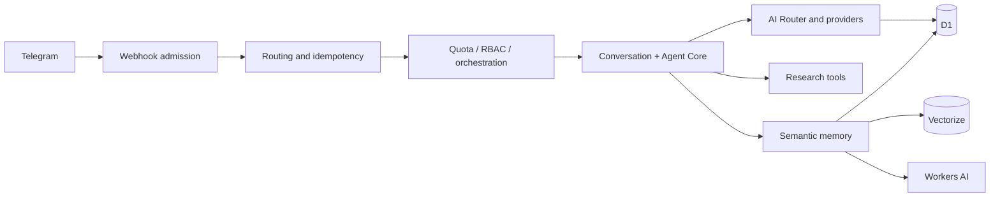

# HawkTalk

**A Telegram-first, provider-independent AI assistant running on Cloudflare Workers.**

<!-- Future asset: replace this intentional placeholder with `docs/assets/README/banner.png`. -->


[](https://www.typescriptlang.org/)
[](https://workers.cloudflare.com/)
[](https://vitest.dev/)

> **Project status:** active development. No public release or CI status is asserted here.

## Overview

HawkTalk receives Telegram updates, admits valid private-chat traffic, routes requests through a provider-neutral Agent Core, and persists state in Cloudflare D1. Transport, security, orchestration, model providers, tools, memory, and persistence are deliberately separated and independently testable.

## Implemented capabilities

- Telegram webhook authentication, bounded parsing, private-chat restrictions, and durable update idempotency.
- Provider-independent Agent Core and an OpenAI-compatible multi-provider router with weighted selection, bounded attempts, cooldowns, and encrypted credentials.
- Owner-scoped conversations and messages in D1.
- Read-only `web_search` and `web_fetch` tools with strict parsing, bounds, sanitization, SSRF defenses, and untrusted-result delimiters.
- Role-aware quotas, rate limits, abuse protection, Telegram-native RBAC/admin operations, confirmations, and audit logging.
- Research mode, usage/cost recording, explicit memory commands, and semantic memory using Workers AI `@cf/baai/bge-m3` plus Vectorize.

## Stack

| Area | Technology | Status |
| --- | --- | --- |
| Runtime | Cloudflare Workers + TypeScript | Implemented |
| Relational persistence | Cloudflare D1 / SQLite | Implemented |
| Embeddings | Workers AI, `@cf/baai/bge-m3` | Implemented for semantic memory |
| Vector search | Cloudflare Vectorize | Implemented for semantic memory |
| Messaging | Telegram Bot API | Implemented |
| Testing | Vitest, Cloudflare Workers pool | Implemented |
| Durable Objects, R2, Tasks/Workflows | — | Not currently used; future candidates |

## Architecture at a glance



The rendered architecture illustration slot is reserved at `docs/assets/README/architecture.png`.

## Screenshots and gallery

Visual assets are intentionally not fabricated. Add future captures under `docs/assets/screenshots/`:

| Slot | Reserved path |
| --- | --- |
| Telegram conversation | `telegram-chat.png` |
| Admin interface | `admin.png` |
| Research flow | `research.png` |
| Memory interaction | `memory.png` |
| Architecture | `architecture.png` |

## Quick start

Requires Node.js `>=22.13.0 <23`, npm, and Wrangler.

```bash
npm install
npm run db:migrate:local
npm run dev
```

Copy `.dev.vars.example` to `.dev.vars` for local Telegram secrets. The file is ignored and must never contain committed values.

## Commands

```bash
npm test                 # Vitest suite
npm run typecheck        # generated Wrangler types + TypeScript
npm run lint             # ESLint, zero warnings
npm run build            # Wrangler dry-run build
npm run security         # npm audit
npm run check            # all validation commands
```

## Documentation map

- [Architecture](ARCHITECTURE.md) — layers, request flow, and service boundaries.
- [Development](DEVELOPMENT.md) — local setup, migrations, providers, tools, and memory.
- [Testing](TESTING.md) — test organization and validation expectations.
- [Deployment](DEPLOYMENT.md) — deployment entry point and operational runbooks.
- [Security](SECURITY.md) — implemented controls and operational responsibilities.
- [Contributing](CONTRIBUTING.md) · [Support](SUPPORT.md) · [Changelog](CHANGELOG.md)
- [Implementation roadmap](docs/IMPLEMENTATION-ROADMAP.md) — phase history and future scope.
- [Detailed deployment runbook](docs/DEPLOYMENT-RUNBOOK.md) · [smoke tests](docs/SMOKE-TESTS.md) · [rollback](docs/ROLLBACK.md)

## Database and migrations

Ordered SQL migrations live in [`migrations/`](migrations/). Apply them locally with `npm run db:migrate:local`; remote migration application is human-controlled and documented in [DEPLOYMENT.md](DEPLOYMENT.md).

## Security and support

Read [SECURITY.md](SECURITY.md) before handling secrets, webhook configuration, provider credentials, or production data. This checkout has no configured public support URL or maintainer contact channel.

## License

No `LICENSE` file is present in this repository. Licensing terms should be supplied by the project owner before publishing a license badge or release metadata.
