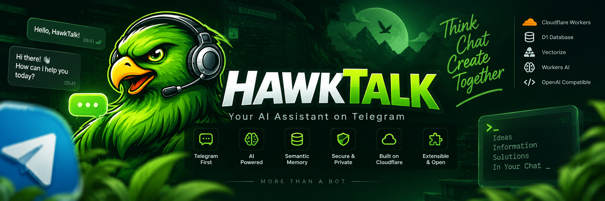

# HawkTalk

<p align="center">
  
</p>

<p align="center">
  <strong>A Telegram-first, provider-independent AI assistant built for private, secure, and extensible AI conversations.</strong>
</p>

<p align="center">
  <a href="https://github.com/Greenhawk5/HawkTalk">Repository</a>
  &nbsp;·&nbsp;
  <a href="docs/ARCHITECTURE.md">Architecture</a>
  &nbsp;·&nbsp;
  <a href="DEVELOPMENT.md">Development</a>
  &nbsp;·&nbsp;
  <a href="SECURITY.md">Security</a>
  &nbsp;·&nbsp;
  <a href="CHANGELOG.md">Changelog</a>
</p>

<p align="center">
  
  
  
  
</p>

<p align="center">
  
</p>

<p align="center">
  <sub>More than a bot — a modular AI assistant designed around Telegram.</sub>
</p>

---

## ✦ What is HawkTalk?

**HawkTalk** is a Telegram-first personal AI assistant running on **Cloudflare Workers**.

Instead of coupling the bot directly to a single model provider, HawkTalk separates Telegram transport, request admission, orchestration, model routing, tools, memory, persistence, and administration into independent boundaries.

That makes the system easier to test, secure, extend, and evolve without redesigning the entire application around one provider.

```text
                         ┌──────────────────────┐
                         │       Telegram       │
                         └──────────┬───────────┘
                                    │
                                    ▼
                         ┌──────────────────────┐
                         │ Webhook Admission    │
                         │ Validation / Policy  │
                         │ Idempotency          │
                         └──────────┬───────────┘
                                    │
                                    ▼
                         ┌──────────────────────┐
                         │ Application / Agent  │
                         │      Core            │
                         └──────────┬───────────┘
                                    │
                    ┌───────────────┼────────────────┐
                    ▼               ▼                ▼
             ┌────────────┐  ┌────────────┐  ┌────────────┐
             │ AI Router  │  │ Web Tools  │  │  Memory    │
             │ Providers  │  │ Search /   │  │ Embeddings │
             │            │  │ Fetch      │  │ + Vectorize│
             └─────┬──────┘  └────────────┘  └─────┬──────┘
                   │                                │
                   └──────────────┬─────────────────┘
                                  ▼
                         ┌──────────────────────┐
                         │ D1 + Vectorize + AI  │
                         └──────────────────────┘
```

---

## ✦ Highlights

| | |
|---|---|
| 💬 **Telegram-first** | Designed around Telegram as the primary conversational interface. |
| 🧠 **Provider-independent** | Agent Core is separated from model providers and protocol-specific adapters. |
| 🔀 **Multi-provider routing** | OpenAI-compatible providers can be routed through bounded attempts and cooldown/failover logic. |
| 🧠 **Semantic memory** | User-scoped memory powered by Workers AI embeddings and Vectorize. |
| 🔐 **Security-focused** | Webhook verification, idempotency, encrypted credentials, SSRF protections and scoped data access. |
| 🔎 **Research tools** | Constrained `web_search` and `web_fetch` capabilities with explicit untrusted-content boundaries. |
| ☁️ **Cloudflare-native** | Built around Workers, D1, Vectorize and Workers AI. |
| 🧩 **Extensible architecture** | Transport, orchestration, providers, tools, memory and persistence remain independently testable. |

---

## ✦ Technology Stack

### Core

<p>
  
  
  
</p>

### Cloudflare

<p>
  
  
  
  
  
</p>

### AI & Providers

<p>
  
  
  
</p>

### Testing & Quality

<p>
  
  
  
  
</p>

---

## ✦ Core Capabilities

### Telegram & Request Processing

- Secure Telegram webhook verification.
- Bounded request parsing and validation.
- Private-chat-only conversational processing.
- Durable update idempotency.
- Policy checks, rate limits, quotas and abuse handling.
- Confirmation flows and audit logging.

### Agent Core & Providers

- Provider-independent application-level Agent Core.
- Common OpenAI-compatible adapter.
- Multiple provider credentials.
- Bounded routing attempts.
- Cooldown and failover behavior.
- Provider credentials encrypted before D1 storage.

### Research & Web Tools

HawkTalk can use constrained research tools for external information retrieval.

Tool execution is bounded by:

- validated inputs,
- network restrictions,
- fetch limits,
- output-size limits,
- retry limits,
- SSRF protections,
- explicit untrusted-content boundaries.

External pages and tool results are treated as **untrusted data**, not as system instructions.

### Semantic Memory

HawkTalk keeps conversational persistence and semantic memory as separate concerns.

```text
                Workers AI
             @cf/baai/bge-m3
                     │
                     ▼
                 Embedding
                     │
                     ▼
                 Vectorize
                     │
                     ↕
              D1 Memory Metadata
```

Memory is user-scoped and degrades gracefully if the required AI or Vectorize capability is unavailable.

---

## ✦ Architecture

The application is intentionally divided into clear boundaries:

```text
Telegram
   │
   ▼
Webhook / Admission
   │
   ├── Authentication
   ├── Validation
   ├── Idempotency
   └── Policy
   │
   ▼
Application Orchestration
   │
   ▼
Provider-independent Agent Core
   │
   ├── AI Router
   │    └── OpenAI-compatible providers
   │
   ├── Research Tools
   │    ├── web_search
   │    └── web_fetch
   │
   └── Semantic Memory
        ├── Workers AI
        └── Vectorize
   │
   ▼
D1 Persistence
   │
   ▼
Telegram Response
```

For the full architecture, request lifecycle, persistence boundaries, provider model and security boundaries, see:

**[Architecture Documentation →](docs/ARCHITECTURE.md)**

---

## ✦ Security

Security is treated as an architectural concern rather than a final checklist.

Implemented controls include:

- Telegram webhook authentication.
- Durable idempotency protection.
- User-scoped conversations and messages.
- Encrypted provider credentials using AES-GCM.
- Role-aware admission controls.
- Rate limiting and abuse handling.
- SSRF protection for external fetching.
- Bounded external tool execution.
- Explicit separation of trusted instructions from untrusted research content.
- Audit logging.
- Secrets kept outside source control.

See **[SECURITY.md](SECURITY.md)** for the security policy and vulnerability-reporting process.

---

## ✦ Quick Start

### Requirements

- Node.js `>=22.13.0 <23`
- npm
- Wrangler
- A local configuration based on `.dev.vars.example`

### Installation

```bash
git clone https://github.com/Greenhawk5/HawkTalk.git
cd HawkTalk
npm install
Copy-Item .dev.vars.example .dev.vars
npm run db:migrate:local
npm run dev
```

For non-PowerShell shells, copy `.dev.vars.example` to `.dev.vars` using the equivalent command.

> `.dev.vars` is local-only and must never be committed.

---

## ✦ Development Commands

| Command | Purpose |
|---|---|
| `npm run dev` | Start local Wrangler development |
| `npm run db:migrate:local` | Apply D1 migrations to local state |
| `npm run types` | Generate Wrangler environment types |
| `npm run typecheck` | TypeScript validation |
| `npm run lint` | ESLint with zero warnings allowed |
| `npm test` | Run the test suite |
| `npm run build` | Wrangler dry-run build |
| `npm run security` | Run `npm audit` |
| `npm run check` | Full validation pipeline |

`npm run check` is the repository's aggregate quality gate.

---

## ✦ Configuration & Secrets

Development secrets are represented in `.dev.vars.example` and loaded from the ignored `.dev.vars` file.

Current secret categories include:

- Telegram bot token.
- Telegram webhook verification secret.
- Provider-credential encryption master secret.
- Owner bootstrap identity.

Production secrets are configured separately through Wrangler.

**Never commit or expose:**

```text
API keys
Bot tokens
Encryption keys
Private URLs
Credentials
Production secrets
```

---

## ✦ Providers

HawkTalk uses a provider-neutral Agent Core and a common OpenAI-compatible provider adapter.

The current architecture is designed to support compatible providers such as:

- OpenRouter
- Z.AI
- Google Gemini

Provider credentials are:

1. entered through the provisioning workflow,
2. encrypted before D1 storage,
3. kept outside Telegram chat history,
4. excluded from ordinary logs,
5. selected through bounded routing and cooldown logic.

See **[DEPLOYMENT-RUNBOOK.md](docs/DEPLOYMENT-RUNBOOK.md)** for provisioning guidance.

---

## ✦ Documentation

| Document | Purpose |
|---|---|
| [Architecture](docs/ARCHITECTURE.md) | System architecture and security boundaries |
| [Development](DEVELOPMENT.md) | Local development and contribution workflow |
| [Testing](TESTING.md) | Test strategy and validation |
| [Deployment](DEPLOYMENT.md) | Deployment overview |
| [Security](SECURITY.md) | Security policy and vulnerability reporting |
| [Contributing](CONTRIBUTING.md) | Contribution standards |
| [Code of Conduct](CODE_OF_CONDUCT.md) | Community standards |
| [Support](SUPPORT.md) | Support and issue reporting |
| [Changelog](CHANGELOG.md) | Release history |
| [Notice](NOTICE.md) | Third-party notices and attribution |
| [Citation](CITATION.cff) | Citation metadata |
| [Repository Hardening](REPOSITORY_HARDENING.md) | Repository hardening checklist |
| [Deployment Runbook](docs/DEPLOYMENT-RUNBOOK.md) | Human-controlled production runbook |
| [Smoke Tests](docs/SMOKE-TESTS.md) | Post-deployment verification |
| [Rollback](docs/ROLLBACK.md) | Operational rollback procedures |

---

## ✦ Project Status

**Current documentation status:** `1.0.0-rc.1` — Release Candidate 1.

This is a pre-release state for the upcoming `1.0.0` release. The project remains under active development and may receive additional fixes and refinements before the stable release.

---

## ✦ License

HawkTalk is released under the **MIT License**.

See the [LICENSE](LICENSE) file for the complete license text.

---

## ✦ Author

<p align="center">
  <strong>Ali Faniani / GreenHawk</strong>
</p>

<p align="center">
  <a href="https://github.com/Greenhawk5">GitHub</a>
  &nbsp;·&nbsp;
  <a href="https://github.com/Greenhawk5/HawkTalk">HawkTalk Repository</a>
</p>

---

<p align="center">
  <sub>Built with TypeScript, Cloudflare Workers, D1, Vectorize, Workers AI and Telegram.</sub>
</p>
