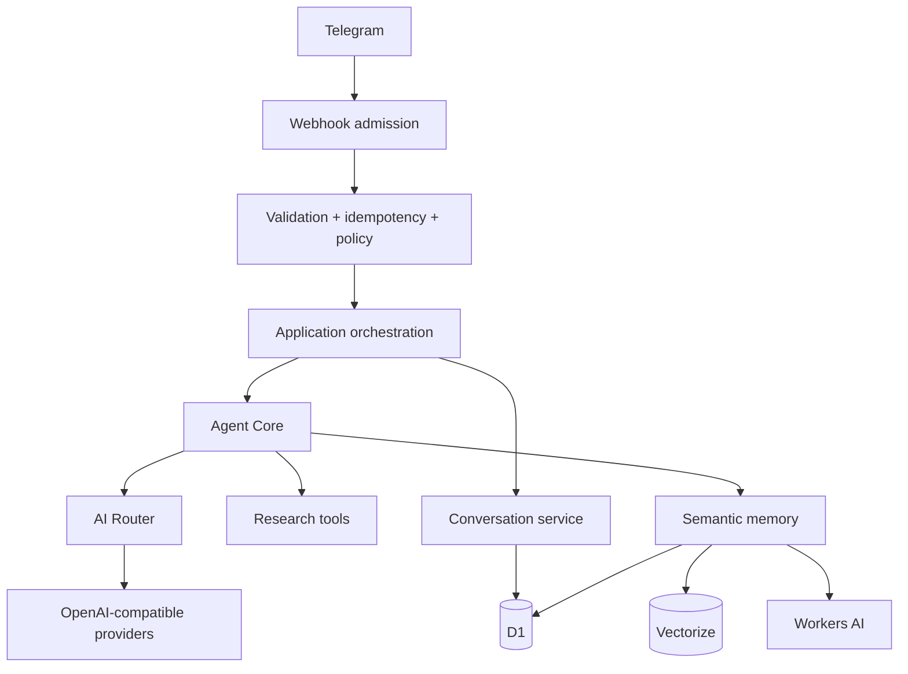

# HawkTalk Architecture

[Back to README](../README.md) · [Security](SECURITY.md) · [Development](../DEVELOPMENT.md)

## Architectural model

HawkTalk is organized as narrow layers with explicit ownership and security boundaries.



## Layers

| Layer | Responsibility |
| --- | --- |
| Worker entry / routing | HTTP routing, request IDs, shared response controls |
| Telegram adapter | Webhook validation, update parsing, Telegram API calls |
| Admission | Role, quota, rate window, abuse policy, durable processing decisions |
| Orchestration | Coordinates the application use case |
| Agent Core | Provider- and transport-independent request validation and model invocation |
| AI Router | Provider selection, credential access, bounded retries/cooldowns, common adapter |
| Conversations | Owner-scoped message persistence and bounded context |
| Tools | Web search/fetch registry, parsing, limits, SSRF controls |
| Memory | Explicit memory commands, embeddings, vector search, ownership filters |
| Administration | Authorization, confirmations, provider/user/policy management, audit |
| Persistence | D1 repositories and migration-backed schema |

## Telegram request lifecycle

1. `POST /telegram/webhook` validates method, content type, size, secret, JSON and update structure.
2. The update is claimed atomically using the durable idempotency model.
3. Unsupported updates and non-private chats stop before conversational processing.
4. Admission checks role, quota, rate policy and blocked-user state.
5. The internal user and default conversation are resolved.
6. The user message is persisted and bounded history is constructed.
7. Agent Core validates and normalizes the request.
8. The AI Router chooses an available provider and credential.
9. Research tools may run through the bounded tool loop.
10. Assistant output and usage state are persisted.
11. The Telegram adapter delivers the final response.

## Provider architecture

HawkTalk uses a provider-neutral model port and an OpenAI-compatible adapter. Provider-specific details stay below the Agent Core boundary.

Providers may have multiple credentials for rotation and quota distribution. Credentials are encrypted at rest in D1 and are never expected to pass through Telegram or ordinary logs.

## Persistence

D1 is the relational source for application state. Major state groups include:

- users and ownership,
- processed updates,
- conversations and messages,
- admission and policy state,
- providers and credentials,
- administration,
- usage,
- memory metadata.

Semantic vectors live in Vectorize. The memory layer applies an owner filter and reconnects vector hits to valid D1 metadata. The cross-system write is not treated as one atomic transaction.

## Memory architecture

```text
User memory command / conversation
            ↓
      Memory service
        ↙       ↘
     D1          Workers AI
 metadata       embeddings
        ↘       ↙
         Vectorize
```

Memory content is user-scoped and treated as data rather than system instructions.

## Tool architecture

Tools are registered behind a common interface. Inputs are validated before execution and outputs are bounded before being placed in model context.

The web layer applies HTTPS and destination restrictions, including protection against local/private/metadata-style targets.

## Security boundaries

- Telegram is an untrusted transport boundary.
- External web content is untrusted data.
- Model providers are replaceable infrastructure dependencies.
- Credentials are secrets and never part of the conversational data model.
- Memory and conversation state are user-owned.
- Administrative authorization is server-side.
- Failure of optional memory dependencies must not silently grant broader permissions.

## Environments

`wrangler.toml` currently defines:

- `dev`: local D1 and local development configuration,
- `staging`: provisioning placeholder,
- `production`: human-provisioned D1, Workers AI, Vectorize, and secrets.

Production provisioning and deployment remain operator actions; this documentation does not imply that CI can deploy production.
