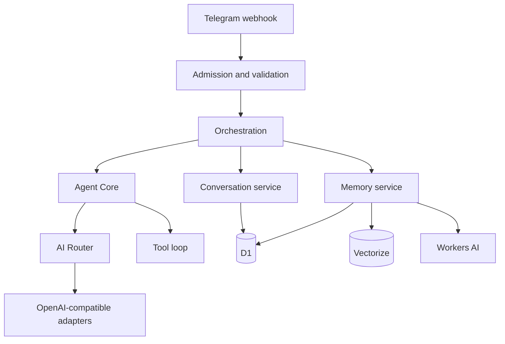

# HawkTalk architecture

[Back to the README](../README.md) · [Security](../SECURITY.md) · [Development](../DEVELOPMENT.md)

HawkTalk is a Cloudflare Worker organized around narrow ports and adapters. Telegram is an input/output adapter; Agent Core does not know about Telegram, D1, credentials, or network access.

## Runtime layers

## Source boundaries

| Layer | Main modules | Responsibility |
| --- | --- | --- |
| Entry and routing | `src/index.ts`, `src/router/` | Worker handler, routes, request IDs, safe response headers |
| Telegram | `src/telegram/` | Parse updates, authenticate webhook, send replies, user/admin/memory commands |
| Admission | `src/orchestration/admission.ts`, `src/db/admission-d1.ts` | Role, quota, rate-window, and durable per-update decisions |
| Orchestration | `src/orchestration/` | Coordinates the use case and durable processing state |
| Agent Core | `src/agent/` | Validates and normalizes model requests; invokes only the provider port |
| AI | `src/ai/` | Provider directory, encrypted credential access, routing, retries/cooldowns, OpenAI-compatible adapter |
| Conversations | `src/conversation/`, `src/db/conversation-*` | Validated owner-scoped history and message persistence |
| Tools | `src/tools/` | Registry, parser, bounded loop, web search/fetch, SSRF protection |
| Memory | `src/memory/`, `src/db/memory.ts` | Explicit commands, embeddings, Vectorize lookup, D1 metadata, untrusted context |
| Administration | `src/admin/`, `src/db/admin-*` | RBAC, policy/provider/user management, confirmations, audit records |

## Request lifecycle

1. `POST /telegram/webhook` verifies the Telegram secret header, content type, body size, JSON shape, and update structure.
2. The update is claimed atomically in D1. Redelivery reuses durable results and never regenerates already-started work.
3. Unsupported updates and non-private chats are acknowledged without entering conversation processing.
4. Private text updates pass admission. Rejections are deterministic and do not touch conversations or AI providers.
5. The flow resolves the internal user and default conversation, persists the user message, loads bounded history, and invokes Agent Core.
6. The AI Router selects enabled provider metadata and decryptable credentials, applying bounded attempts and cooldowns.
7. Research tools execute through the registry and return explicitly untrusted, truncated results.
8. Assistant output, usage metadata, and processing state are persisted before Telegram delivery.

## Persistence and ownership

D1 stores users, processed updates, policies, conversations, messages, provider configuration, admin records, usage events, and memory metadata. User-owned queries are scoped by internal user ID. Vectorize stores semantic vectors separately; each vector carries an owner filter and is joined back to active, synced D1 records. The memory write sequence is not cross-system atomic.

## Security boundaries

- Credentials cross neither Telegram nor Agent Core; provider secrets are sealed before D1 storage and require `CREDENTIAL_MASTER_SECRET` to use.
- Tool output and recalled memory are wrapped as untrusted context and cannot become system instructions.
- Web fetch is HTTPS-only and blocks local, private, link-local, multicast, metadata, and other restricted targets.
- Missing production secrets, D1, Workers AI, or Vectorize dependencies fail closed or disable the dependent capability.
- Admin commands are private-chat-only, re-authorized against current server state, and destructive actions require durable confirmation.

## Environments

`wrangler.toml` defines local `dev` D1. Staging and production intentionally have no remote bindings in this checkout; provisioning and secret configuration are human-only steps. Durable Objects are not used by the current implementation.
